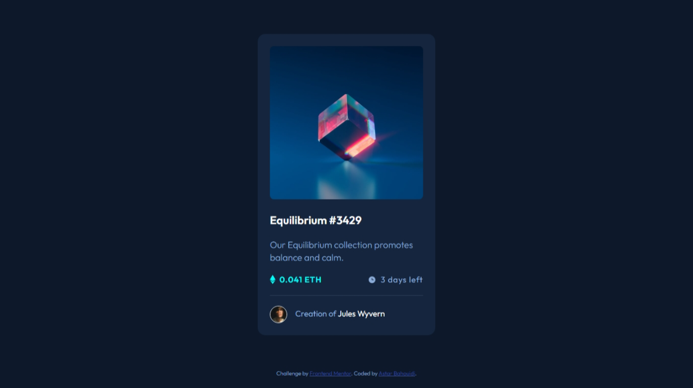
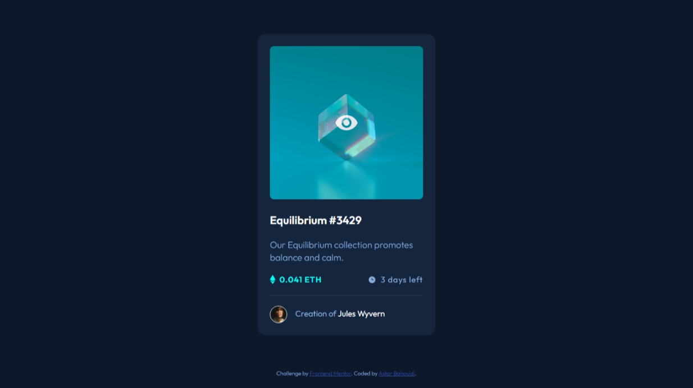

# Frontend Mentor - NFT preview card component solution

This is a solution to the [NFT preview card component challenge on Frontend Mentor](https://www.frontendmentor.io/challenges/nft-preview-card-component-SbdUL_w0U). Frontend Mentor challenges help you improve your coding skills by building realistic projects.

## Table of contents

- [Frontend Mentor - NFT preview card component solution](#frontend-mentor---nft-preview-card-component-solution)
  - [Table of contents](#table-of-contents)
  - [Overview](#overview)
    - [The challenge](#the-challenge)
    - [Screenshot](#screenshot)
    - [Links](#links)
  - [My process](#my-process)
    - [Built with](#built-with)
    - [The Man Remembers 😶](#the-man-remembers-)
    - [The Piece of Cake 🍰](#the-piece-of-cake-)
  - [Author](#author)

## Overview

### The challenge

Users should be able to:

- [x] View the optimal layout depending on their device's screen size
- [x] See hover states for interactive elements

### Screenshot




### Links

- [My Frontend Mentor Solution](https://www.frontendmentor.io/solutions/scaring-to-glow-out-of-a-card-component-WlxtQEuJWG) of the nft-preview-card-component.
- [Live site](https://matondo99.github.io/nft-preview-card-component/) of the nft-preview-card-component.

## My process

### Built with

- Semantic HTML5 markup
- CSS custom properties
- Combination of CSS pseudo element and pseudo class
- Flexbox
- Mobile-first workflow

### The Man Remembers 😶

Since `::before` and `::after` css pseudo elements insert their content relative to the content of the element they are attached to **they are useless on self-contained element like the `img` element.**

### The Piece of Cake 🍰

```css
.hero::before {
  content: "";
  width: 100%;
  height: 100%;
  background: var(--clr-primary-shine-o) url(../images/icon-view.svg) center no-repeat;
  position: absolute;
  opacity: 0;
  transition: opacity 300ms ease-in 100ms;
}

.hero:focus::before,
.hero:hover::before {
  opacity: 1;
}
```

**Stark and Straight.**

😎

## Author

- Github - [Astar Bahouidi](https://github.com/Matondo99)
- Frontend Mentor - [@Matondo99](https://www.frontendmentor.io/profile/Matondo99)
